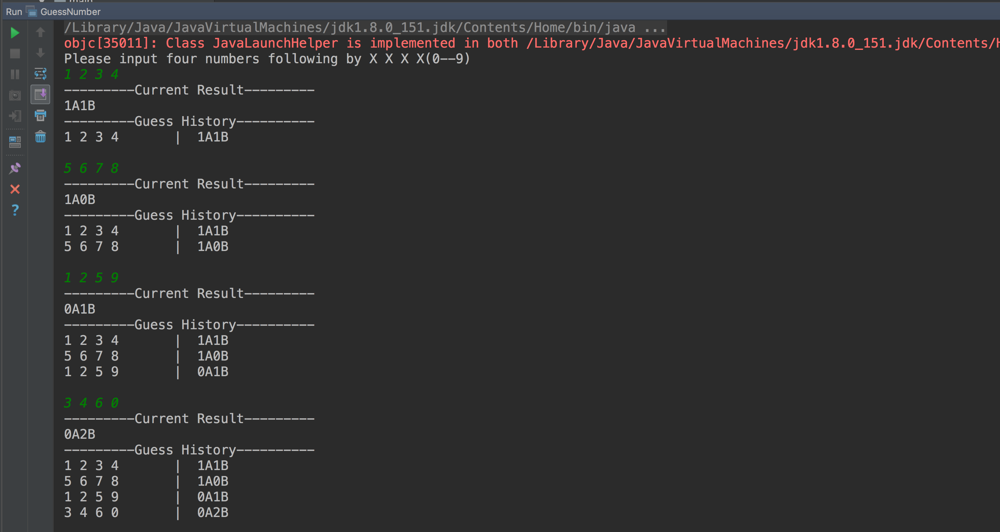
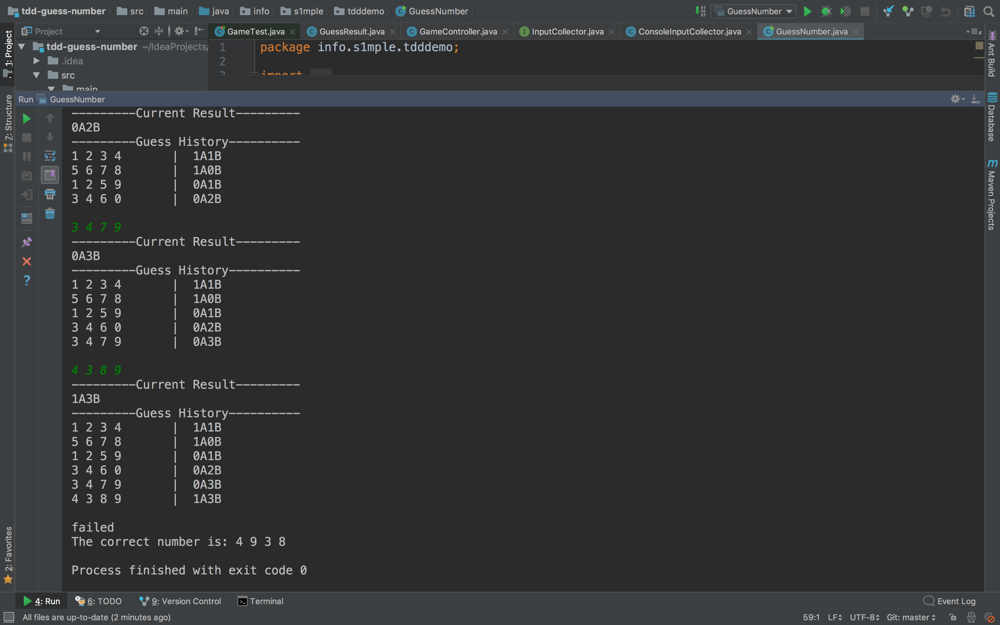
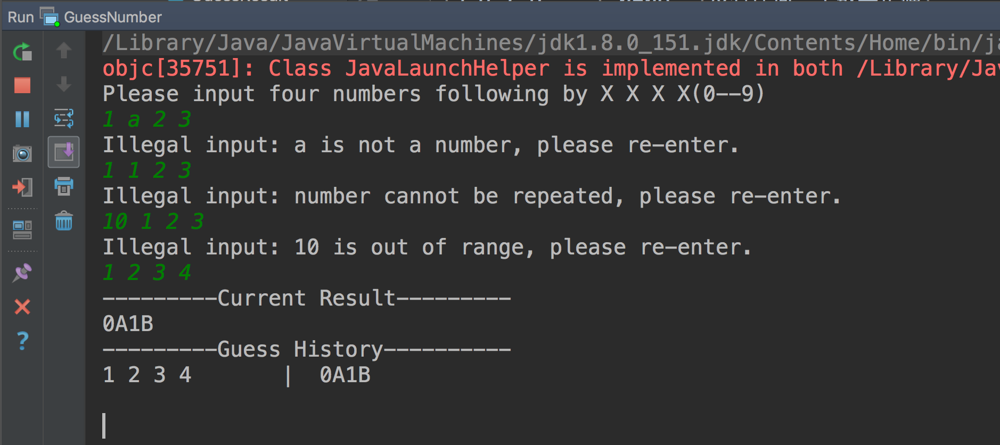

# tdd-guess-number
TDD 猜数字游戏的示例代码

## 前言
本示例代码根据张逸总监[《TDD编码实战讲义》](http://zhangyi.xyz/handout-tdd-code-kata/)编写

## 目标收益
- 熟悉 IntelliJ IDEA 快捷键；
- 掌握 TDD 基本知识；
- 识别代码坏味道，熟练运用重构手法；
- 使用 JUnit、AssertJ 与 Mockito 测试框架；
- 使用 Google Guice 轻量级依赖注入框架；

## 整体需求
实现猜数字的游戏。游戏有四个格子，每个格子有一个0到9的数字，任意两个格子的数字都不一样。你有6次猜测的机会，如果猜对则获胜，否则失败。每次猜测时需依序输入4个数字，程序会根据猜测的情况给出xAxB的反馈，A前面的数字代表位置和数字都对的个数，B前面的数字代表数字对但是位置不对的个数。

例如：答案是1 2 3 4， 那么对于不同的输入，有如下的输出

|输入  |	输出	|  说明  |
|-------------| :--------:|--------|
|1 5 6 7 | 1A0B	|1位置正确|
|2 4 7 8 |	0A2B	|2和4位置都不正确|
|0 3 2 4	| 1A2B	|4位置正确，2和3位置不正确|
|5 6 7 8	| 0A0B	|没有任何一个数字正确|
|4 3 2 1	| 0A4B	|4个数字位置都不对|
|1 2 3 4	| 4A0B	|胜出 全中|
|1 1 2 3	| 输入不正确，重新输入	||
|1 2	|输入不正确，重新输入	||

答案在游戏开始时随机生成。输入只有6次机会，在每次猜测时，程序应给出当前猜测的结果，以及之前所有猜测的数字和结果以供玩家参考。输入界面为控制台（Console），以避免太多与问题无关的界面代码。输入时，用空格分隔数字。

## 单元测试
单元测试使用 Junit 框架，Mockito 框架的`mock`注入类和返回数据，AssertJ 框架进行断言

```java
@Before
public void setUp() throws Exception {
    AnswerGenerator answerGenerator = mock(AnswerGenerator.class);
    when(answerGenerator.generate()).thenReturn(actualAnswer);
    game = new Game(answerGenerator);
}

@Test
public void should_record_every_guess_result() {
    game.guess(Answer.createAnswer("2 1 6 7"));
    game.guess(Answer.createAnswer("1 2 3 4"));
    game.guess(Answer.createAnswer("1 2 6 7"));
    game.guess(Answer.createAnswer("0 3 2 4"));

    List<GuessResult> guessHistory = game.guessHistory();

    assertThat(guessHistory.size()).isEqualTo(4);
    assertThat(guessHistory.get(0).result()).isEqualTo("0A2B");
    assertThat(guessHistory.get(1).result()).isEqualTo("4A0B");
    assertThat(guessHistory.get(2).result()).isEqualTo("2A0B");
    assertThat(guessHistory.get(3).result()).isEqualTo("1A2B");
}
```
`verify`方法是否按要求被调用
```java
@Test
public void should_display_guess_message_when_guess_number_twice_and_second_answer_is_correct() {
    Answer errorAnswer = Answer.createAnswer("1 2 5 6");
    Answer correctAnswer = Answer.createAnswer("1 2 3 4");
    when(mockCollector.input()).thenReturn(errorAnswer, correctAnswer);

    gameController.play(mockCollector);

    verify(mockGameView).showCurrentResult(
            argThat(guessResult -> !guessResult.isCorrect() && guessResult.result().equals("2A0B")));
    verify(mockGameView).showCurrentResult(
            argThat(guessResult -> guessResult.isCorrect() && guessResult.result().equals("4A0B")));
    verify(mockGameView, times(2)).showGuessHistory(argThat(results -> results.size() == 2));
}
```


## 运行结果截图
运行主类 GuessNumber




当输入不满足要求时响应相关消息

